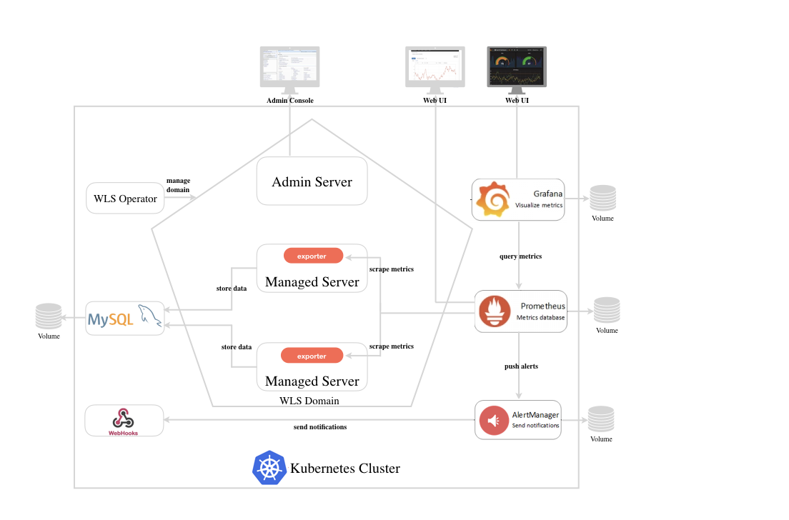

## Monitoring WebLogic Server with the Grafana Dashboard
This is an end-to-end sample that shows you the steps to set up monitoring for WebLogic domains using Prometheus and Grafana. In the end, you'll have Prometheus, Grafana, and WLS domains installed, configured, and running. This sample includes Grafana dashboards to visualize the WebLogic Server runtime metrics. We also demostrate how to fire alerts based on the metrics.

First, let's look at [what's in the WebLogic Server Dashboard](docs/dashboard.md).

Before going into the detailed steps, look at the diagram below for the overall architecture containing the basic components we'll deploy to a Kubernetes cluster.



Here's how the WebLogic runtime metrics are generated, stored and processed:
- WebLogic Servers expose their runtime data via the REST API.
- The exporter, running on each WebLogic Server instance, acquires WebLogic data by calling the REST API, which it then translates to the Prometheus metrics format and exposes in an HTTP endpoint.
- The Prometheus server is responsible for periodically scraping the metrics from the endpoints and storing them in its time series database.
- graphing
  - The Grafana server queries the metrics from Prometheus server using PromQL and displays the metrics and series in a visualization dashboard.
- alerting
  - Alerting rules are defined in Prometheus server in the form of PromQL expressions. 
  - When the condtions of alerts are met, Prometheus server is responsible for firing alerts to the Alertmanager.
  - Alertmanager deduplicates, groups and routes all the alerts and send notifications accordingly to receivers like email, slack, webhook etc. In this sample we set up a simple webhook as the receiver.

## Prerequisites
- Have a running Kubernetes cluster version 1.10 or higher.
- Have Helm installed.  
- Clone this repository.
  ```
  git clone https://github.com/oracle/weblogic-monitoring-exporter.git
  ```
- Change the directory to the root folder of this sample. All the commands in the step-by-step guide below are written to run under this root folder.
  ```
  cd weblogic-monitoring-exporter/samples/kubernetes/end2end/
  ```

## Step-by-Step Guide
1. [Configuring the PV Path](docs/01-pv-path.md)
1. Preparing and Running a WLS Domain
    1. [Setting up MYSQL Server](docs/02-mysql.md)
    1. [Installing the WLS Kubernetes Operator](docs/03-wls-operator.md)
    1. [Running a WLS Domain](docs/04-wls-domain.md)
1. [Setting up Prometheus](docs/05-prometheus.md)
1. [Setting up Grafana](docs/06-grafana.md)
1. Setting up and Firing Alerts
    1. [Setting up a Webhook](docs/07-webhook.md)
    1. [Firing Alerts](docs/08-alert.md)

Follow the [cleanup](docs/cleanup.md) after you finish this guide and want to clean up your environment.
