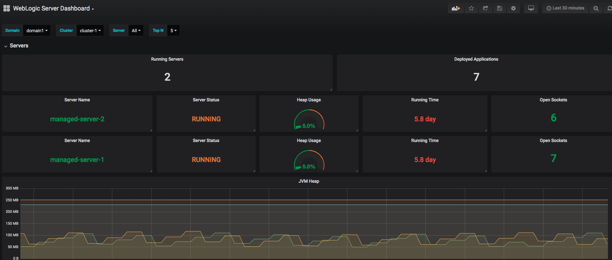

## Setting up Grafana
Install Grafana using a [Helm chart](https://github.com/helm/charts/tree/master/stable/grafana) with the customized [values.yaml](../grafana/values.yaml) file.

Deploy the PV and PVC YAML file.
```
kubectl apply -f grafana/persistence.yaml
```
Create the Grafana administrative credentials.
```
kubectl --namespace monitoring create secret generic grafana-secret --from-literal=username=admin --from-literal=password=12345678
```
Install the Grafana chart.
```
helm install --wait --name grafana --namespace monitoring --values grafana/values.yaml stable/grafana
```
### Verification
Wait until the Grafana pod is running.
```
kubectl -n monitoring get pod -l app=grafana
```
> output
```
NAME                       READY   STATUS    RESTARTS   AGE
grafana-7bc95b7545-dz8dg   1/1     Running   0          26h
```
Check the Grafana sevices.
```
kubectl -n monitoring get svc -l app=grafana
```
> output
```
NAME      TYPE       CLUSTER-IP     EXTERNAL-IP   PORT(S)        AGE
grafana   NodePort   10.105.155.5   <none>        80:31000/TCP   26h
```
Now you can access the Grafana web UI in your browser at `http://<HostIP:31000>` with the user name and password, `admin:12345678`.

### Creating a Data Source and Dashboard
#### Using the Grafana web UI
Refer to the Grafana docs:
- [Creating a Prometheus Data Source](https://grafana.com/docs/features/datasources/prometheus/)
- [Importing Dashboards](https://grafana.com/docs/reference/export_import/)  

To create a Prometheus data source:
- From the Grafana menu, select `Configuration` -> `Data Sources`, then click `Add Data Source`.
- On the `Choose data source type` page, click `Prometheus`.
- Use the following values to add the Prometheus data source:
  ```
  Name: Prometheus
  Default: true
  URL: http://prometheus-server:80
  ```
- Click `Save & Test`.

Now the Prometheus data source is created.  

To import the WebLogic dashboard:
- From the Grafana menu, select `Dashboards` -> `Manage`, then click `Import`.
- On the `Import` page, click `Upload .json File`, then select the [WebLogic dashboard file](../dashboard/weblogic_dashboard.json) to import.

#### Using the Grafana REST API
Alternatively, you can do this by calling the Grafana REST API.  
Create the Prometheus data source with the predefined JSON file.
```
curl -v -H 'Content-Type: application/json' -H "Content-Type: application/json" \
  -X POST http://admin:12345678@$HOSTNAME:31000/api/datasources/ \
  --data-binary @grafana/datasource.json
```
Create the WebLogic dashboard with the predefined JSON file.
```
curl -v -H 'Content-Type: application/json' -H "Content-Type: application/json" \
  -X POST http://admin:12345678@$HOSTNAME:31000/api/dashboards/db \
  --data-binary @grafana/dashboard.json
```
### Verification
Use the Grafana web UI to confirm that the resources are created successfully.

Check the datasource.  
  

Check the WebLogic dashboard.  


You can monitor the WebLogic domain with the dashboard now.

Next: [Setting up a Webhook](07-webhook.md)
