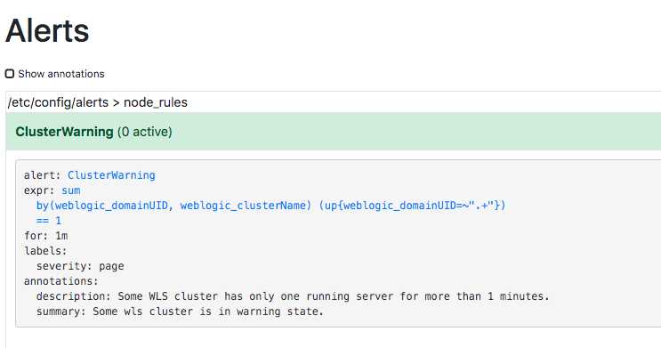
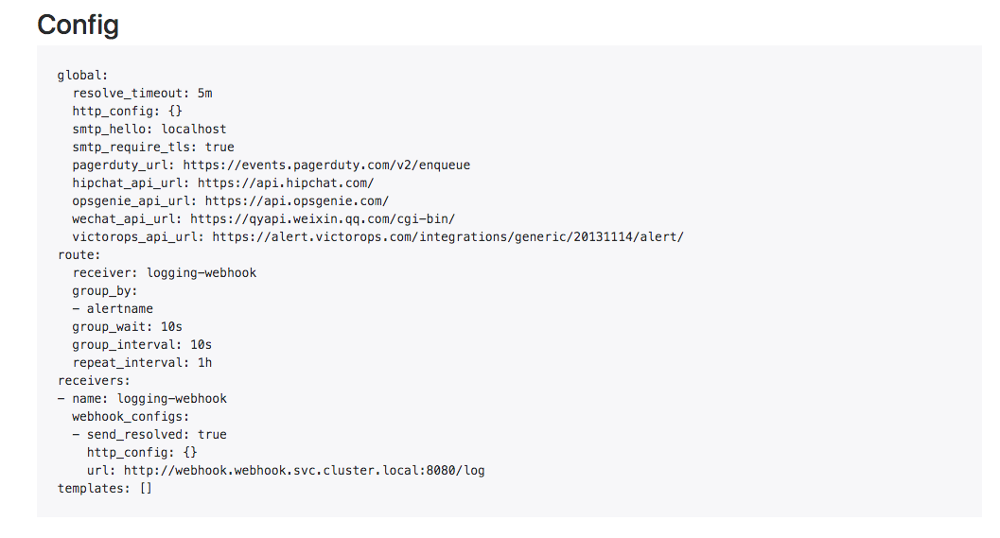
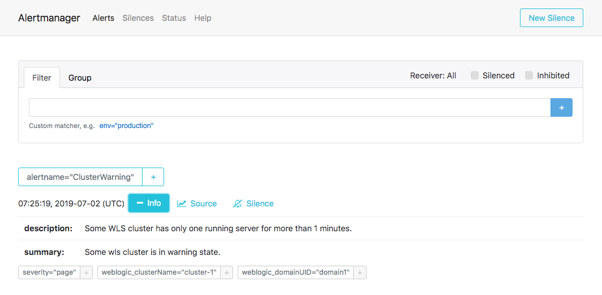

## Firing Alerts
In this step we show you how to fire alerts.

### Configuring Alerts
We do all the alerting related configurations in the customized [values.yaml](../prometheus/values.yaml) when installing the Prometheus chart.  

First, configure alerting rules. For demonstration purpse, We define one [alerting rule](../prometheus/values.yaml#L45) named 'ClusterWarning' that will fire alerts if some WebLogic cluster has only one running server.

Second, configure Alertmanager. In [alertmanager.yml](../prometheus/values.yaml#L27) we define one route and one receiver that will send all the received alerts to a webhook.

### Verifying Configuration
Access the Prometheus alerts page in your browser with the URL `http://<HostIP>:30000/alerts`. Check the configured alert rules. You should get something like below.  

  

Go to Alert Manager web UI via the URL `http://<HostIP>:32000`. 
- Check the configured rule and receiver via the URL `http://<HostIP>:32000/#/status`. You should get something similar as below.  

  
- Check the alert page via the URL `http://<HostIP>:32000/#/alerts`. There is no received alert yet.

### Triggering Alerts
To trigger alerts, one WebLogic cluster need to have only one managed server running. 
- Update file `demo-domains/domain1.yaml` to change the line from `replicas: 2` to `replicas: 1`.
- Apply the updated domain resource file.
  ```
  kubectl apply -f demo-domains/domain1.yaml
  ```
If the new domain resource is applied successfully, one WebLogic server will start to termiate. Wait until only one managed server is running.
```
kubectl get pod -l weblogic.domainName=domain1
```
> output
```
NAME                       READY   STATUS    RESTARTS   AGE
domain1-admin-server       1/1     Running   1         2h
domain1-managed-server-1   1/1     Running   1         2h
```

Then keep refreshing the Prometheus alerts page `http://<HostIP>:30000/alerts`. There will be one alert generated. First the alert is in `PENDING` state. After about 1 minutes (as configured),  the alert state is changed to `FIRING` and this is the time that the alert is actually sent to the Alert Manager. 


### Verification in Alert Manager
Now let's check whether the Alert Manager has received the alert. Visit the Alert Manager's alert page in URL `http://<HostIP>:32000/#/alerts` and you should find one alert as below.



### Verification in Webhook Server
After the Alert Manger received the alert, it's supposed to send notifications to the configured receiver - the webhook. Let's check the output of webhook server.
Get the pod name of the webhook server.
```
POD_NAME=$(kubectl -n webhook get pod -l app=webhook -o jsonpath="{.items[0].metadata.name}")
```
Check the output of the webhook server.
```
kubectl -n webhook logs -f $POD_NAME
```
> output
```
Webhook is serving at port 8080
192.168.0.127 - - [02/Jul/2019 07:25:29] "POST /log HTTP/1.1" 200 -
!!! Receiving an alert.
{
  "status": "firing",
  "labels": {
    "alertname": "ClusterWarning",
    "severity": "page",
    "weblogic_clusterName": "cluster-1",
    "weblogic_domainUID": "domain1"
  },
  "annotations": {
    "description": "Some WLS cluster has only one running server for more than 1 minutes.",
    "summary": "Some wls cluster is in warning state."
  },
  "startsAt": "2019-07-02T07:25:19.190499581Z",
  "endsAt": "0001-01-01T00:00:00Z",
  "generatorURL": "http://prometheus-server-547f5d857c-m4d8t:9090/graph?g0.expr=sum+by%28weblogic_domainUID%2C+weblogic_clusterName%29+%28up%7Bweblogic_domainUID%3D~%22.%2B%22%7D%29+%3D%3D+1&g0.tab=1"
}
```
One notification is recieved and logged by the webhook server.
